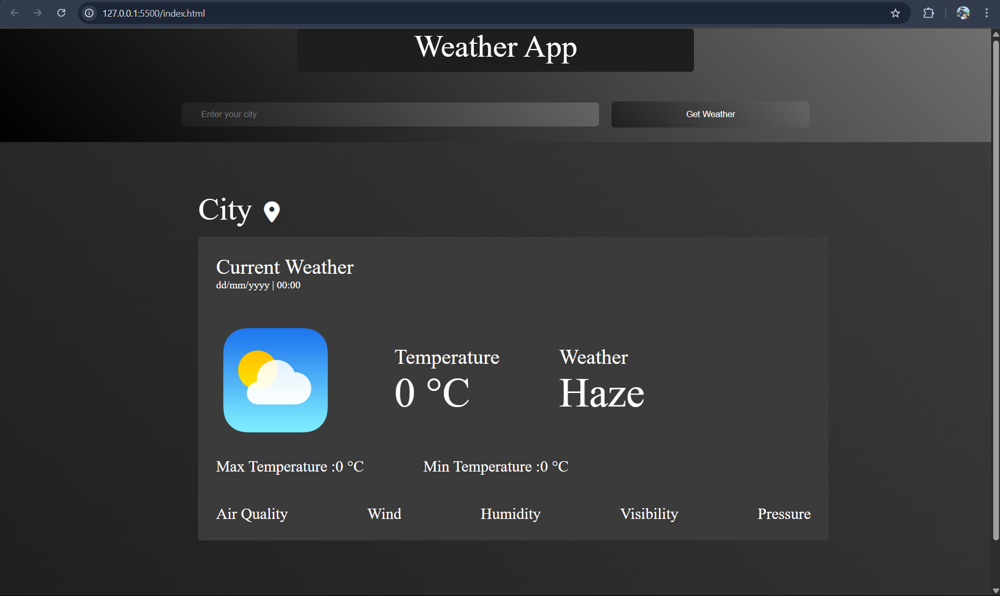

# 🌤️ Weather App

A clean and responsive weather application that fetches real-time weather data and air quality using the OpenWeatherMap API. Built using **HTML**, **CSS**, and **JavaScript**.

---

## 🚀 Features

- Search weather by city name
- Shows:
  - Current temperature, max/min temperature
  - Weather condition (e.g., haze, rain, clear)
  - Wind speed, humidity, pressure
  - Visibility and air quality index (AQI)
- Localized date & time in IST (India Standard Time)
- Fully responsive and styled using CSS

---

## 🔧 Tech Stack

- HTML5
- CSS3 (custom styling, gradients)
- JavaScript (DOM manipulation + fetch API)
- [OpenWeatherMap API](https://openweathermap.org/)

---

## 📸 Screenshot



> Add a screenshot image in your project folder and name it `screenshot.png`.

---

## 🔑 How to Use

1. Clone this repo:
```bash
https://github.com/Experio2705/Mini-Projects.git
